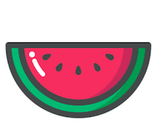

## In Class Activity

You can complete the following practice in a new Xcode project. Make sure you select working with Storyboard.

### Part 1: Creating the StackView

1. Add three UIImageView items to the view.
1. Embed them in a vertical UIStackView.
1. Pin the stack view 20 points from the superview in all edges (leading, trailing, top, bottom).

You can use these images or use your own: 

### Part 2: StackView Distribution Types

#### Fill

This is the default distribution type.
When you insert elements into a UIStackView with the distribution set to fill, it will keep all but one item at its intrinsic size and stretch it to fill the remaining space.
It determines the view to fill by the Content Hugging Priority (CHP). The view with the **lowest** CHP is stretched to fill the space in the UIStackView.

If all of your views in the UIStackView have the same CHP, Xcode will show an ambiguous layout error. 😨

StackView Control

Banana Content Hugging Priority

To get the same result as the image, make sure you set the banana's CHP to 250, 251 for the others.

#### Fill Equally

Each view in the UIStackView will have the equal size. The CHP does not matter with this type of distribution, because the views are of equal size.

#### Fill Proportionally

This distribution type will try to fill a UIStackView with the intrinsic content size of the elements in the StackView.

With Fill and Fill Equally, the StackView determines how large the elements are, with Fill Proportionally, the size of the elements are determined by the intrinsic size of its elements.

#### Equal Spacing

This distribution type will keep an equal spacing between each of the views but will not resize the views themselves.
It uses the intrinsic size of its views.

- --

#### Equal Centering

This type of distribution will divide the stack view according to the number of elements and place the elements

## Benefits of using stack views

- Layout is re-calculated when views are hidden or added! Try hiding an element in the stack and see what happens.
  1. Change the distribution to Equal spacing.
  2. Select the orange and check the box "hidden" in the Attributes Inspector.
  3. You should see the orange disappear and the banana and watermelon reposition to fill the new space.
- Advice: Try to build interface with UIStackView, add explicit constraints only when necessary or when it doesn't make sense to use stacks.
