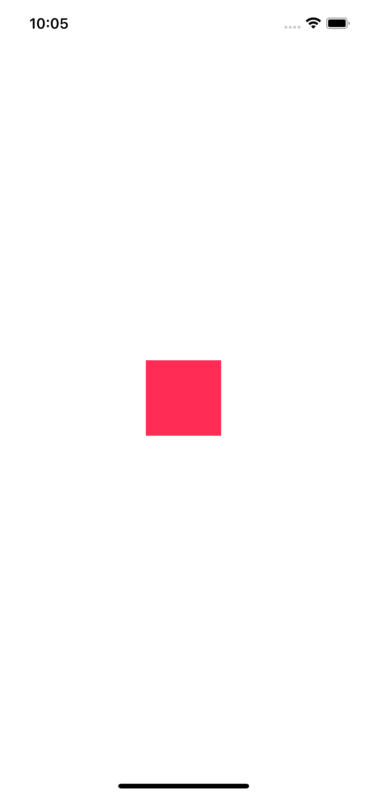

<!-- Run this slideshow via the following command: -->
<!-- reveal-md README.md -w -->

<!-- .slide: class="header" -->
# Coding Constraints

## [Slides](https://make-school-courses.github.io/MOB-1.2-Introduction-to-iOS-Development/Slides/03-CodingConstraints/README.html ':ignore')

<!-- > -->

## Agenda

- Learning Objectives
- Constraints programmatically
- Anchors and Layout Constraints

<!-- > -->

## Learning Objectives

By the end of this lesson, students should be able to:

1. Use the `NSLayoutConstraint` and `NSLayoutAnchor` classes
1. Set up a scroll view using only code
1. Create an onboarding flow with AutoLayout programmatically

<!-- > -->

## Making Constraints and views in code 

Followe the steps below to: 

- Create a new view with code
- Add constraints to your view with code

You can follow these steps to create position and constrain any UI element with code!

### Make a new Xcode iOS Project 

- Make a new project 
- Choose iOS
- Choose App
- Click OK
- Choose Storyboard
- Choose Swift

### Make a new view

In ViewController.swift

Add a new variable to hold the new view. 

```swift
var exampleView = UIView(frame: .zero)
```

Here you made a new UIView with a frame of zero. That is x = 0, y = 0, width = 0, and height = 0. Imagine a point in the upper left corner. 

Since we are using constraints the size and position of the view won't matter! 

**Important!** creating an instance of a view doesn't make it visible! It needs to be added as a subview of a view that is a subview of the root view to be drawn to the screen! 

You'll do this in the next step. 

### Adding a subview

In ViewController.swift's `viewDidLoad` method add the following: 

```Swift
exampleView.backgroundColor = .systemPink
exampleView.translatesAutoresizingMaskIntoConstraints = false
self.view.addSubview(exampleView)
```

Here you are setting the background color of `exampleView`. Then turning off the automatic constraints that the system will want to create. You can read more about `translatesAutoresizingMaskIntoConstraints` here: 

https://developer.apple.com/documentation/uikit/uiview/1622572-translatesautoresizingmaskintoco

It's important that we turn this off, because we are going to create our own constraints and these would conflict with the auto generated constraints. 

Last, you're adding `exampleView` as a sub view to the viewController's view, which is a UIView, and is the root view! 

Think about the outline view the storyboard editor. The at the top, just under ViewController, is this root view! All other views are children of that view. Here you are adding `exampleView` as a child via code. 

### Add some constraints

Add the following at the bottom of `viewDidLoad`: 

```Swift
exampleView.widthAnchor.constraint(equalToConstant: 80).isActive = true
exampleView.heightAnchor.constraint(equalTo: exampleView.widthAnchor, multiplier: 1).isActive = true
exampleView.centerXAnchor.constraint(equalTo: self.view.centerXAnchor).isActive = true
exampleView.centerYAnchor.constraint(equalTo: self.view.centerYAnchor).isActive = true
```

Here you added 4 constraints. Here is a description of each: 

- `widthAnchor` sets the width to 80
- `heightAnchor` sets the height to the height of the `widthAnchor`
- `centerXAnchor` sets the x position to the horizontal center of the root view. 
- `centerYAnchor` sets the y position to the center of the vertical center of the root view. 

### Test your work

Save your work, then run the project in the iOS simulator. You shoud see something like: 



Notice the view is pink, the width and height are 80, and it's positioned in the center. 

### Experiments!

Change the width and height constants. Currently the height constant is equal to the width, so changing the width will also change the height. Try it! 

Set the height constant. Change `equalTo` to `equalToConstant` and remove `multiplier: 1`. Try it! 

Rememer when we mentioned `translatesAutoresizingMaskIntoConstraints` and how this created auto generated constraints? Try commenting out the line: 

`exampleView.translatesAutoresizingMaskIntoConstraints = false`

See what happens when you have the auto generated constraints and your dynamically generated constraints. 

You should see an error something: 

```
Coding-Constraints[78127:6565764] [LayoutConstraints] Unable to simultaneously satisfy constraints.
	Probably at least one of the constraints in the following list is one you don't want. 
    ...
```

Note the line: **Unable to simultaneously satisfy constraints.**. Sounds about right if there were some other constraints besides the ones that you defined in `viewDidLoad`. 

Read more about this here: https://www.thecodedself.com/autoresizing-masks/

Try one more. Change the width constraint to: 

```Swift
exampleView.widthAnchor.constraint(equalTo: self.view.widthAnchor, multiplier: 0.5).isActive = true
```

Here the width will 50% of the root view. Try it on different devices. 

One more experiment. This you'll make another view and set the frame without constraints. 

The first view was created with a frame of `.zero`. This may look a little string. It's an enum for the `CGRect.zero`. 

Since `UIView(frame: CGRect)` expects a `CGRect` Swift does require that include the type, it's inferred. So either of these works: 

```Swift
UIView(frame: CGRect.zero)
UIView(frame: .zero)
```

To define a `CGRect` you'll define the x, y, width, and height. 

Add the following at the top of the `ViewController` class:

```Swift 
var newView = UIView(frame: CGRect(x: 0, y: 100, width: 100, height: 100))
```

This should define a new UIView at x = 0, y = 100, with a width = 100 and a height = 100. 

Next, in `viewDidLoad` set the background color of new view and add it as a subview. 

```Swift
newView.backgroundColor = .systemTeal
self.view.addSubview(newView)
```

Test your work! You should have another view near the top of the screen. This view doesn't have any constraints, except for the auto generated constraints. That means it will not change size or position if the screen changes sizes. 

<!-- > -->

## Best Practices

- As much as you can, never calculate frames manually
- Set `translatesAutoresizingMaskIntoConstraints` to false
- Add the view to the hierarchy with `addSubview`
- Activate your constraints

<!-- > -->

## In Class Activity

<iframe src="https://www.youtube.com/embed/W7nj-fkH0VY" data-autoplay  width="700" height="500"></iframe>

<!-- v -->

Using the anchors approach, code the following:


<aside class="notes">
- Square 2 is 50 pts below the square 1
- Square 2 is twice the size of square 1
- Square 2 to the right of square 1
</aside>

<!-- > -->

## NSLayoutConstraint class

<iframe src="https://www.youtube.com/embed/fQlEaJxHfcc" data-autoplay  width="700" height="500"></iframe>

<!-- v -->


This method explicitly converts the constraint equation into code. Each parameter corresponds to a part of the equation.

<aside class ="notes">
Unlike the approach taken by the layout anchor API, you must specify a value for each parameter, even if it doesn’t affect the layout. The end result is a considerable amount of boilerplate code, which is usually harder to read.
</aside>

<!-- > -->

## Example

Examine how this code works and then place a new view to the right of the exampleView.

```Swift
import PlaygroundSupport
import UIKit

class ViewController: UIViewController {

    var exampleView: UIView!
    var redView: UIView!

    override func loadView() {
        super.loadView()

        exampleView = UIView()
        exampleView.translatesAutoresizingMaskIntoConstraints = false
        self.view.addSubview(exampleView)

        redView = UIView()
        redView.translatesAutoresizingMaskIntoConstraints = false
        self.view.addSubview(redView)

        NSLayoutConstraint (item: exampleView!, attribute: .width, relatedBy: .equal, toItem: nil, attribute: .notAnAttribute, multiplier: 1.0, constant: 80).isActive = true
        NSLayoutConstraint(item: exampleView!, attribute: .height, relatedBy: .equal, toItem: nil, attribute:.notAnAttribute, multiplier: 1.0, constant:80.0).isActive = true
        NSLayoutConstraint(item: exampleView!, attribute: .leading, relatedBy: .equal, toItem: view, attribute: .leading, multiplier: 1.0, constant: 60.0).isActive = true
        NSLayoutConstraint(item: exampleView!, attribute: .top, relatedBy: .equal, toItem: view, attribute: .topMargin, multiplier: 1.0, constant: 20.0).isActive = true

        NSLayoutConstraint (item: redView!, attribute: .width, relatedBy: .equal, toItem: nil, attribute: .notAnAttribute, multiplier: 1.0, constant: 80).isActive = true
        NSLayoutConstraint(item: redView!, attribute: .height, relatedBy: .equal, toItem: nil, attribute:.notAnAttribute, multiplier: 1.0, constant:80.0).isActive = true

        NSLayoutConstraint(item: redView!, attribute: .leading, relatedBy: .equal, toItem: exampleView, attribute: .trailing, multiplier: 1.0, constant: 20).isActive = true

        NSLayoutConstraint(item: redView!, attribute: .top, relatedBy: .equal, toItem: exampleView, attribute: .top, multiplier: 1.0, constant: 0.0).isActive = true


    }

    override func viewDidLoad() {
        super.viewDidLoad()
        self.exampleView.backgroundColor = .purple
        self.redView.backgroundColor = .red

    }

}

PlaygroundPage.current.liveView = ViewController()


```

<!--

## Lab & HW

<iframe src="https://www.youtube.com/embed/fFg3poVPX3I" data-autoplay  width="700" height="500"></iframe>


[Onboarding](https://github.com/Make-School-Courses/MOB-1.2-Introduction-to-iOS-Development/blob/master/Lessons/03-CodingConstraints/assignments/onboarding.md)


-->

<!-- > -->

## Stretch Challenge

Look up [constraints with visual format](https://developer.apple.com/library/archive/documentation/UserExperience/Conceptual/AutolayoutPG/VisualFormatLanguage.html). It's another way to add constraints to views. We won't cover it since it's very verbose and not really necessary, but you might see them in the wild, or when working in an old project.

Repeat the first in class activity using the visual format language.

<!-- > -->

## Additional Resources

Free Illustrations
- [unDraw](https://undraw.co/illustrations)
- [drawKit](https://www.drawkit.io)
- [Mobile Design Patterns](https://mobbin.design)
- [Common constraints](https://theswiftdev.com/2018/06/14/mastering-ios-auto-layout-anchors-programmatically-from-swift/)
- [Programmatically creating constraints - Apple Docs](https://developer.apple.com/library/archive/documentation/UserExperience/Conceptual/AutolayoutPG/ProgrammaticallyCreatingConstraints.html)
- [NSLayoutConstraint Class](https://developer.apple.com/documentation/appkit/nslayoutconstraint/1526954-init)
