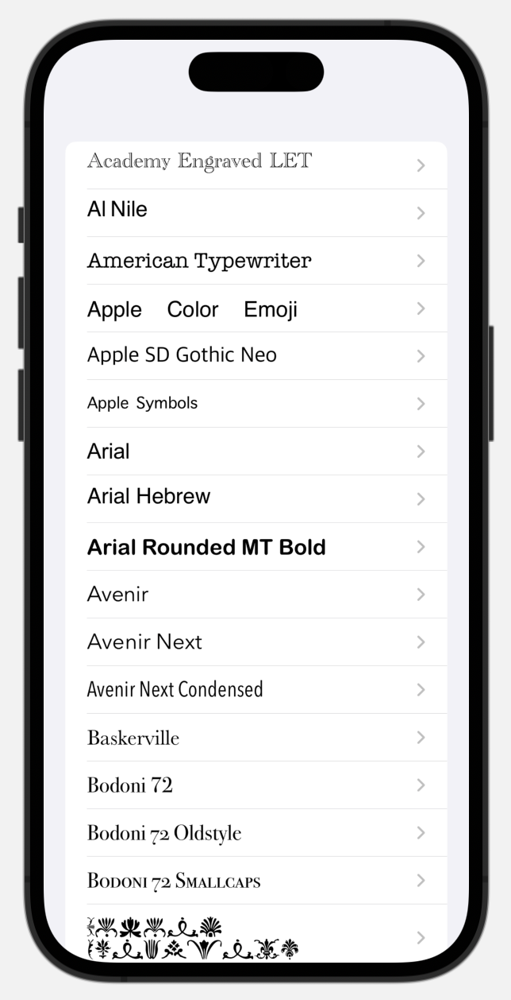
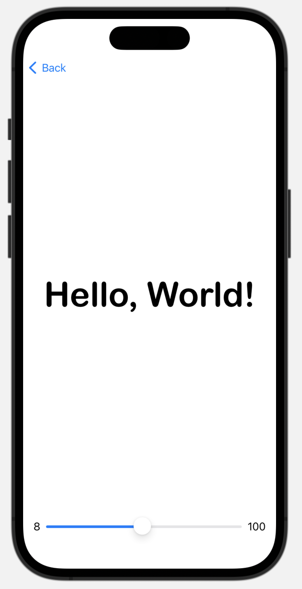

# ACS 2420 Final Assessment

This assessment covers some of the things you have learned in class this term. 

The goal of the assessment is to create a font viewing app. Imagine the product of the assessment as a proof of concept that could be turned into a real app in the future. 

The problem is developers and designed don't know which fonts are available on iOS and need an easy way to check. 

Your app will consist of two screens. The first displays a list of font faces. The second shows a font face and has a slider that adjusts the size of the font. 




## Getting Started 

Create a new Xcode project. Make this an iOS project with SwiftUI as the interface. 

## Content View 

In the Content view create a list of fonts. You can get the list of system fonts with this: 

```Swift
ForEach(UIFont.familyNames, id: \.self) { familyName in
	Text(familyName)
		.font(.custom(familyName, size: 20))
}
```

This should display a list of fonts and make the font family name appear as that font family.

This should display a list of the fonts on your system. 

## Make a detail view

Create a new SwiftUI file. 

Make a variable for the font name. This should be a string. 

Make a @State variable for the size. This should be type CGFloat. 

Set up this view as a VStack. Put a Text element in the center and Slider below. Use Spacers to arrange them. 

Set up the Slider likee this: 

```Swift
Slider(value: $size, in: 8...100) {
	Text("Size")
} minimumValueLabel: {
	Text("8")
} maximumValueLabel: {
	Text("100")
}
```

Notice that you use the @State variable `$size` as the value. `in: 8...100` sets the range of the slider to 8 to 100, `minimumValue:` is a label for the min value, and `maximumValue:` is the label for the max value. You can customize these. 

Be sure to pass a font family name in the preview (at the bottom.) You can use "AmericanTypewriter" to test. 

## Add navigation

In the Content View add a `NavigationStack`. This should wrap the `List`.

Now add a `NavigationLink`. The destination should be the Font Detail view. You'll need to pass the `familyName`!

## Test your app

Your app should work like this: 


